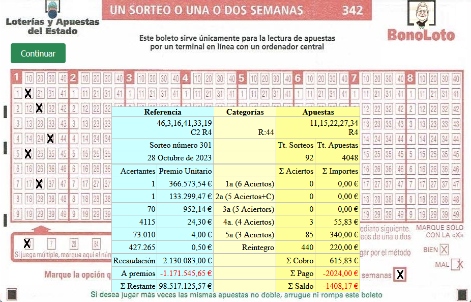

# Aleatoria

## Cálculo

Estudio de un fenómeno aleatorio.

<table><tr><td>

</td></tr></table>

## Descripción

Estudio de un fenómeno aleatorio, en contraposición a fenómenos deterministas, los cuales son resultados únicos y/o previsibles de experimentos realizados bajo las mismas condiciones determinadas, por ejemplo, si se calienta agua a 100 °C a nivel del mar se obtendrá vapor. Los fenómenos aleatorios, por el contrario, son aquellos que se obtienen de experimentos realizados, otra vez, bajo las mismas condiciones determinadas pero como resultado posible poseen un conjunto de alternativas, por ejemplo, el lanzamiento de un dado o de una moneda.
He escogido un juego de azar porque existen todos los datos posibles y más, y sobre el que existe mucha teoría.

## Inicio

### Dependencias

No existen.

### Instalación

Copia index.html y boleto.png ...

### Ejecución

...y ábrelo ¡Eso es todo!

## Ayuda

Interesado en la metodología gráfica, bienvenidas observaciones.

## Autor

Malons para Ofix3.

## Versión

Única.

## Licencia

Libre y a tu propio riesgo.

## Gracias a

Cantidad de iniciativas en la red y detrás de ellas individuos con imaginación y ganas.
